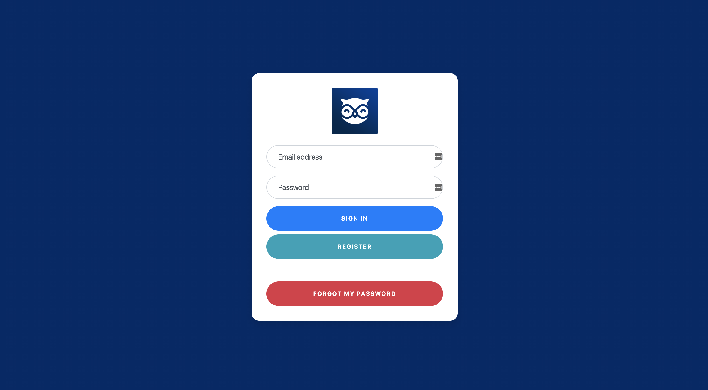
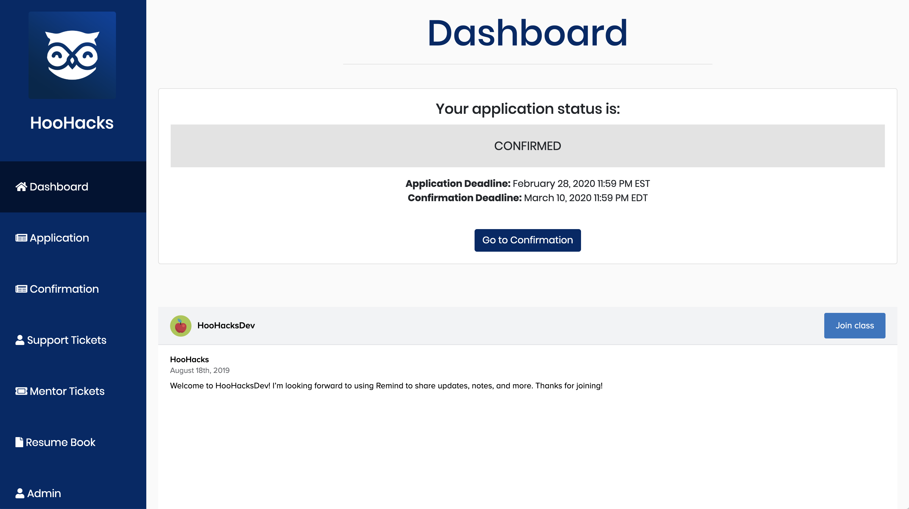
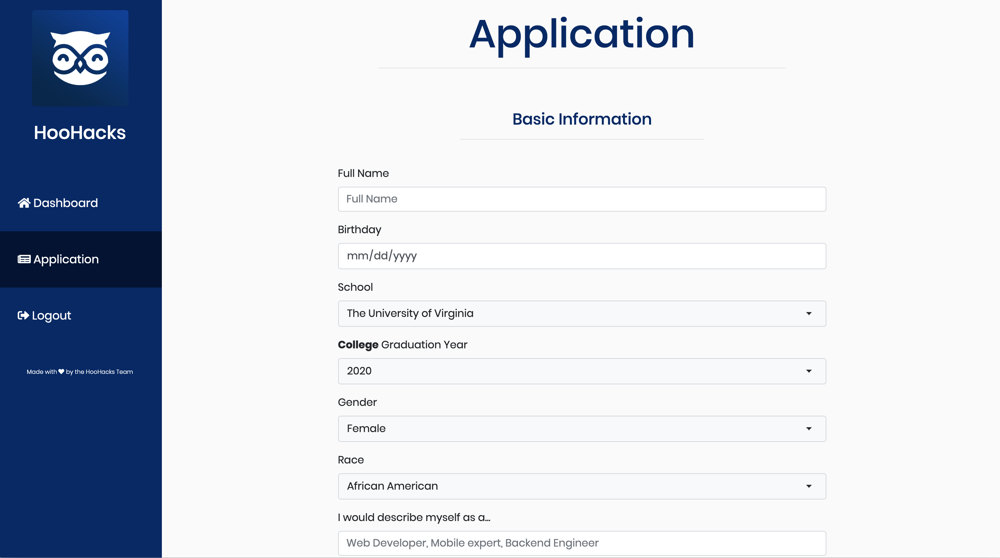
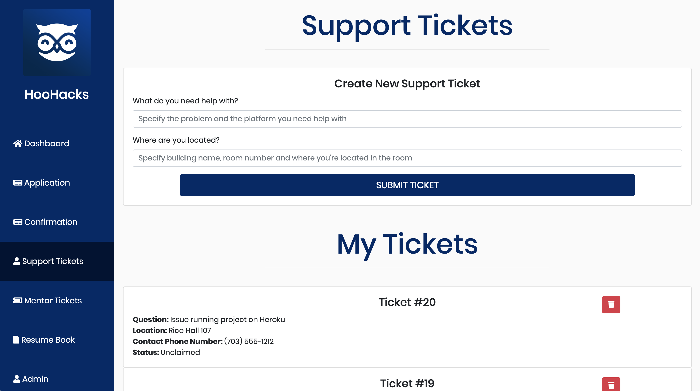
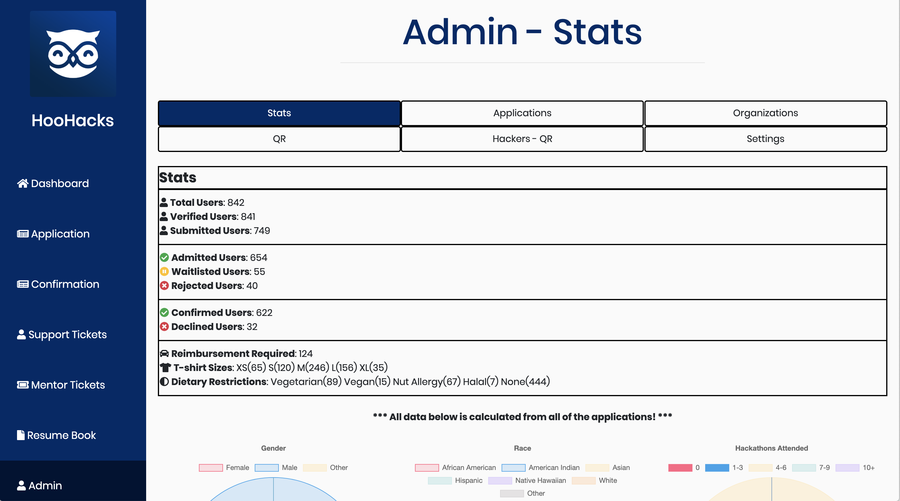
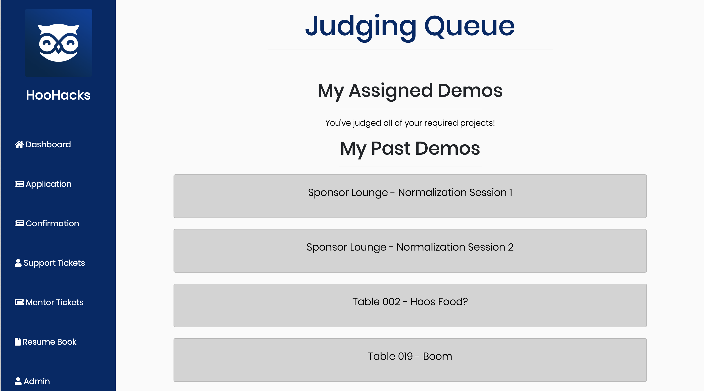

# HackX

### Why use this system?

There are so many different systems that provide the ability to register people for events, but there is no one system that covers all of the things required for running a hackathon. This is where HackX comes in. HackX is the first system that involves hacker registration, mentor registration, judge registration, mentor-ticket queueing, administration views with data analysis, a resume book and judging. We know that's a lot for one system to do. Here's some instructions for setup.

### How does HackX look?

Here's a few pictures of the application.

#### Login Page

#### Dashboard

#### Application

#### Support Tickets Page

#### Admin Page

#### Judging Queue Page

### Deploy to Heroku

Click the button below to Deploy to Heroku. You'll need to setup the config variables with the appropriate values.

### Localhost setup

1. Clone this repository: `git clone https://github.com/rithik/HackX`
2. Rename the `secret.py.example` file to the `secret.py`. Use `cp secret.py.example secret.py` or `mv secret.py.example secret.py`. Add in appropriate variables. 
3. Install all of the required packages for this project. Do this by running `pip3 install -r requirements.txt`
4. Run the flask server by running `./runserver`. You must have Redis installed. Installation instructions can be found here: [https://redis.io/topics/quickstart](https://redis.io/topics/quickstart).
5. Navigate to `http://localhost:8000` and you should see a login screen. You have now setup the HackX environment.

### Things to know

Make sure that your Gmail account is allowed to send emails from less secure apps. Follow directions here: [https://support.google.com/accounts/answer/6010255?hl=en](https://support.google.com/accounts/answer/6010255?hl=en)

To setup a user as an admin in the HackX system, navigate to `http://localhost:8000/make/admin`. Use the `ADMIN_PASSWORD` set in the `secret.py` file.

To setup a user as an mentor in the HackX system, navigate to `http://localhost:8000/make/mentor`. Use the `MENTOR_PASSWORD` set in the `secret.py` file.

To setup a user as a judge in the HackX system, navigate to `http://localhost:8000/make/judge`. Use the `JUDGING_PASSWORD` set in the `secret.py` file.

### Contributors

This system was primarily built by the following people: 

- Rithik Yelisetty (Vice President of Technology of HooHacks)
- Nikash Sethi (Vice President of Technology of HooHacks)
- David Zhao (Former President of HooHacks)

Thank you to the entire HooHacks organization for helping us build out and test this system in addition to the HackMIT team for inspiring us to innovate on their Quill system!
